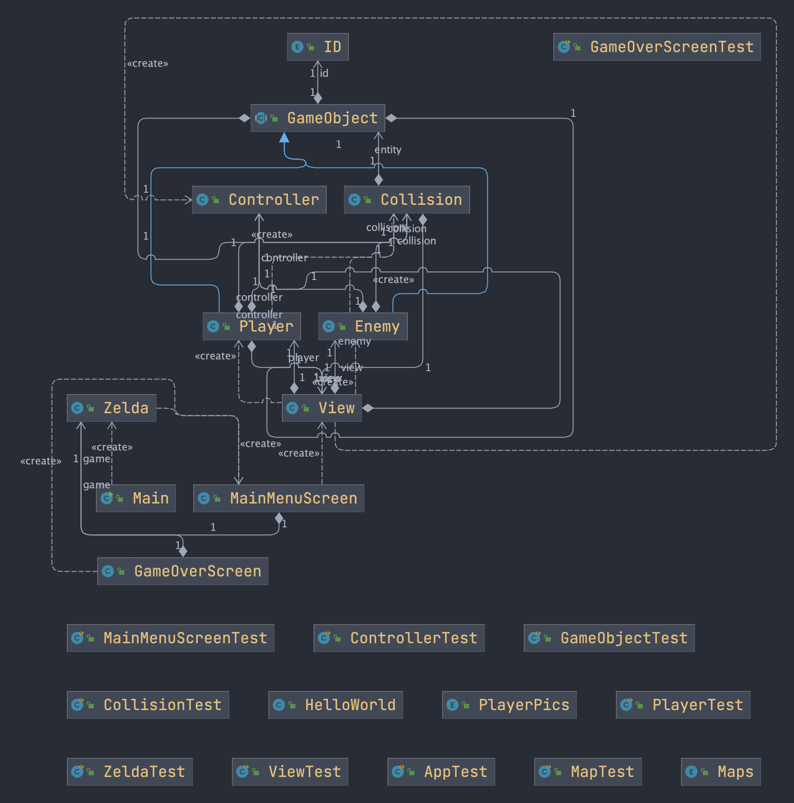

# PROSJEKTRAPPORT

### Hvordan fungerer rollene i teamet? 
Vi opplever at rollene fungerer fint slik som det er nå. Det har vært hjelpsomt å ha en som fordyper seg i GIT og andre som tar ansvar for å lage og oppretteholder kommunikasjon mellom gruppemedlemmene. Ellers opplever vi at medlemmene i gruppen tar ansvar for å ta på seg oppgaver underveis, men vi har behov for å avklare og utdype hva de forskjellige rollene fungerer så det kommer her:

#### Magnus: TEAMLEAD og GitMaster 
Ansvarlig for individene i gruppen. At alle er involvert og opplever at de utvikles i faget. Drive gruppen videre, hjelper til å beslutte hvis det er utfordrende. Sørge for at frister blir imøtekommet og eventuelt ta tak i ting som ikke fungerer som ønsket.
	
#### Casper: Kommunikasjonsansvarlig 
Ansvar for at vi holder oss til møtepunktene. At vi snakker til hverandre på en god måte og bygger relasjoner med alle på teamet. Han har også ansvar for kontakt ut mot kunden.

#### Bjørn: Dokumentasjonsansvarlig
Sørge for at både prosjektet er tilstrekkelig dokumentert og at koden er tilstrekkelig dokumentert med javadoc. 
	
#### Hans-Chr: Testansvarlig, trelloMaster	
Sørger for at alle i gruppen skriver robuste tester til koden de implementerer. 

#### Elias: Produktutvikler, Mapdesigner
Ansvar for å drive produktet framover slik at vi møter produksjonskrav. 

### Trenger vi andre roller?

Arkitekt: 
Vi har nok behov for en arkitekt som har som ansvar å organisere systemet i henhold til SOLID. Er vi for sent ute med dette kan vi ende opp med ganske stor jobb med å sørge for at prosjektet har lav coupling og høy cohesion. 

Dette ansvaret gir vi til Bjørn

Mapdesigner:
At en tar ansvar for å bruke mer tid på å være kreativ med mapdesign.

Dette ansvaret blir vi enige om at Elias tar.

### Har vi erfaringer team-messig eller mtp prosjektmetodikk som er verdt å nevne? 	
Vi synes det var vanskelig å fordele spesifikke arbeidsoppgaver tidlig da vi er nok så uerfarne og MVP ble en slags flaskehals. Når vi kom forbi der ble det lettere å se hva som må gjøres. 

### Prosjektverktøy: 
* Vi startet med GITlab Issueboard, men gikk over til Trello (lettere å logge inn og lettere å bruke). Trello bruker vi som et Kanban board. Vi organiserer oss med elementer av Scrum ved å ha spesifikke arbeidsoppgaver lagt inn i en spesifikk sprint som varer til neste innlevering. 
* Vi benytter oss også mye av parprogrammering i gruppetimer og når vi treffes utenom gruppetimen hver onsdag. Spesielt på de litt 'tyngre' oppgavene som å lage maps i TILED. 

### Liker vi valgene vi har tatt underveis?
Ja. Er ganske enige om de tekniske valgene. Det som ikke har fungert har vi endret (Issueboard). Vi er fortsatt litt usikre på hvilket arkitekturdesign vi skal følge. Nå er vi kommet så langt at det lettere å fordele spesifikke arbeidsoppgaver og gruppemedlemmene opplevere det som lettere å produsere.

### Hvordan er gruppedynamikken? Uenigheter?
Ikke mye uenigheter. Sunne diskusjoner og alle er flinke til å komme med innspill.

### Hvordan har kommunikasjon fungert for oss?
Det har fungert bra. Et av gruppemedlemmene er dog veldig direkte og det går ut over nattsøvnen til resten av gruppen. Medlemmene i gruppen er flinke til å gi beskjed hvis de er forsinket til en gruppetime eller hvis de er syke. Det virker som om alle er like investert i prosjektet og dette er nok hovedgrunnen til at vi ikke har hatt noen konflikter.

### Kort retrospektiv om hva som er bra og hva som kan forbedres. Hva har vi fått til det nå? 
Det har gått litt i rykk og napp, men alle har levert individuelt bra og tatt tak i verktøyene for å lære seg dem. At vi ikke definert små oppgaver og fordelte dem gjorde at vi i starten utvikler ting i hver vår retning. Det oppleves som vi sitter litt på hver vår øy og programmerer, mens vi finner ut av hvordan man gjør dette. Men det er nokså naturlig. Når vi har treffes har vi presentert det vi har jobbet med å bestemt oss for hva vi ønsker å ha med i en merge til developer og jobbe videre med. Framover skal vi jobbe mer samkjørt. At det hver av oss har brukt tid på å produserer sannsynligvis kommer med i sluttproduktet, fordi vi på forhånd har avtalt at det er akkurat dette som skal produseres. Vi anser oss som heldige som har en gruppe hvor alle er engasjert for å få til et godt sluttprodukt.

### Bli enige om maks 3 forbedringspunkter som skal følges opp.
1. Se på semesteroppgaveteksten tidligere etter hver innlevering og jobbe med den mer strukturert. 
2. Oppgaver kan være enda mer spesifikt fordelt slik at det er klarere for den enkelte hva han skal gjøre. For eksempel: "Implementer Player klassen" blir for vagt, vi må bli enige om hvilke metoder og funksjonalitet Player skal ha. 
3. Jobbe mer samkjørt, committe og merge oftere. Flere kan jobbe sammen på samme branch i stedet for at alle arbeider på hver sin branch. Dette gjør også at de som arbeider med den samme delen av klassen også må samarbeide tettere.

## Brukerhistorier, akseptansekriterier og arbeidsoppgaver til MVP (som vi har jobbet med)

1. Som spiller ønsker jeg en MainMenuScreen og en GameOverScreen, slik at jeg kan starte spillet, velge nytt spill og når jeg vinner/taper i spillet så kommer jeg meg tilbake til main menu.

* Akseptansekriterier:
	1. Vi har en startmeny hvor spilleren kan starte et nytt spill.
	2. Vi har en Active Game skjerm, som er skjermen der spillet kjører.
	3. Når spilleren dør, kommer han til Game Over skjermen og kan starte spillet på nytt.
	
* Arbeidsoppgaver:
	1. Alle 3 skjermene skal vises forskjellig på skjermen, hvor Active Game inneholder selvet spillet.
	2. Lage en Startmeny
	3. Ha en keyListener som registrerer når spilleren trykker på start
	4. Lage en metode som registrerer når spilleren er død/har null hit points.
		
2. Som spiller ønsker jeg å se spillbrettet på skjermen slik at jeg kan se hvor fiendene er og hvor jeg kan bevege karakteren min. 
* Gitt at vi har startet et nytt spill, så skal spillbrettet vises på skjermen
		
* Arbeidsoppgaver:
	1. Vi må ha et grid som representerer brettet
	2. Gridet må ha en størrelse.
	
		
3. Som spiller ønsker jeg å se karakteren min på skjermen slik at jeg kan se hvor jeg er og kan gjøre valg
* Gitt at vi har startet et nytt spill, så skal karakteren vises på skjermen
	
* Arbeidsoppgaver:
	1. Vi må ha en spiller-klasse
	2. Karakteren må ha en posisjon
	3. Karakteren må tegnes på skjermen
		
4. Som spiller ønsker jeg at jeg kan bevege karakteren min ved å trykke på tastene slik at jeg kan unngå at fiender skader meg.
* Gitt at vi har startet et nytt spill, brettet vises og karakteren vises, så skal karakteren kunne flyttes:
	1. Nord ved å trykke på "w"
	2. West ved å trykke på "a"
	3. Øst ved å trykke på "d"
	4. Sør ved å trykke på "s"
	
* Arbeidsoppgaver:
	1. Vi må ha en actionListener som registrerer tastetrykk
	2. Vi må ha en metode som tester at spilleren holder seg på brettet (ikke går out of bounds)
	3. Vi må registrere inputs fra bruker slik at spilleren flytter seg i riktig retning.
	4. Modellen må oppdateres med den nye posisjonen
	5. Vi må tegne karakteren i den nye posisjonen
		
5. Som spiller ønsker jeg at det er lett å skille områdene spilleren kan bevege seg på fra hindringer og vegger slik at det er enklere å teste at spillet fungerer som det skal
* Gitt at vi har startet et nytt spill og karakteren kan flyttes, så skal:
	1. Brettet vises med vegger og hindringer
	2. Karakteren ikke kunne passere vegger og hindringer
	
* Arbeidsoppgaver:
	1. Spillbrettet må vise ulike tiles
	2. Vi må skille mellom tiles karakteren kan bevege seg over og tiles som karakteren ikke kan passere
	3. Karakteren, vegger og hindringer må ha kollisjonsbokser
	4. Vi må sørge for at karakteren har lov til å flytte seg i riktig retning.
	5. Modellen må ha informasjon om de ulike tiles-ene og hvor de er.
	6. View må vite hva som skal tegnes hvor og hvordan tiles ser ut

6. Som spiller ønsker jeg at spillet har fiender som spilleren kan drepe, slik at det er noe som skjer i spillet som er underholdende for spilleren.
* Gitt at spillet kjører, så skal det være fiender på spillbrettet

* Arbeidsoppgaver:
	1. Vi må ha et interface for fiender
	2. Vi må ha en abstrakt klasse som utvider interfacet og implementerer alle metodene som er felles for alle fiendene
	3. Vi må ha en(eller flere) fiende klasse(r)
	4. En fiende må ha hitpoints
	5. En fiende må ha en startposisjon
	6. En fiende må ha en hitbox
	7. Fienden må ha en oppførsel/bevegelsesmønster
	8. Fienden må tegnes på skjermen

7. Som spiller ønsker jeg å kunne angripe fiendene slik at jeg kan overvinne dem.
* Gitt at det er fiender på brettet, så skal spilleren kunne angripe og gjøre skade på dem

* Arbeidsoppgaver:
	1. Spillkarakteren må ha en metode som gjør at han skyter eller slår en fiende med et våpen
	2. Det må være en knapp spilleren kan trykke på for å angripe
	3. Det må registreres når spilleren treffer fienden med våpenet
	4. Fienden må miste hit points når den blir truffet
	5. Fienden må dø og forsvinne når den ikke har flere hit points

# Krav og spesifikasjon

Vi har prioritert å lage et MVP. Kriteriene for å oppnå dette spesifiserte vi i oblig1.md. Dette var:

1. Vise spillbrettet
2. Vise spilleren på spillbrettet
3. Kunne bruke tastene til å flytte spilleren
4. En enkel fiende spilleren kan bekjempe
5. Spilleren må ha hit points
6. Spilleren må kunne ta skade og dø
7. Spilleren må kunne gå til et nytt rom
8. En teller som viser hvilket nivå/rom nummer(level) spilleren er på
9. Startskjerm når spillet kjøres
10. Game Over skjerm
11. Mulighet til å starte på nytt

Vi har oppfylt det aller meste av dette. Vi har brukt Tiled til å lage spillbrettet og spillkarakteren vises og kan beveges i åtte retninger. Spillet har en startmeny, active game og game over meny. Når spillet er over, kan du starte på nytt. 

### Prioriteringer framover

Nå som vi har fått et MVP, vil vi bruke tiden framover til å videreutvikle spillet. Vi vil legge til flere fiender, flere maps og skalere fiendene slik at de blir vanskligere å bekjempe jo lenger ut i spillet du kommer. Videre må vi refaktorere koden slik at stukturen blir bedre. Noe av refaktoreringen vi vil gjøre er å skille modellen fra view bedre og lage en MonsterFactory som kan lage nye fiender. Det har gått med mye tid på å bli kjent med libGDX og Tiled, dette har gjort at vi måtte prioritere å få laget et MVP til denne innleveringen, noe som har gått på bekostning av å skrive tester. Framover vil vi gå over til mer testdrevet utvikling hvor vi skriver testene parallelt med koden.

## Produkt og kode:

Dette har vi fikset siden sist:
Vi har at spilleren kan bevege seg i åtte retninger.
Vi har fikset kollisjon mellom spiller og map objektene slik at spilleren ikke kan gå gjennom kartet.
Vi har lagt til fiender som kan angripe spilleren.
Vi har lagt til sverd animasjon.
Vi har lagt til en start meny.
Vi har lagt til en game over meny når man dør.
Vi har lagt til tre forskjellig maps som spiller kan flytte seg gjennom.

For å kjøre spillet så kjører man Main.java filen. ###Skriv om hvordan det testes

## Bildet på klassediagrammet

