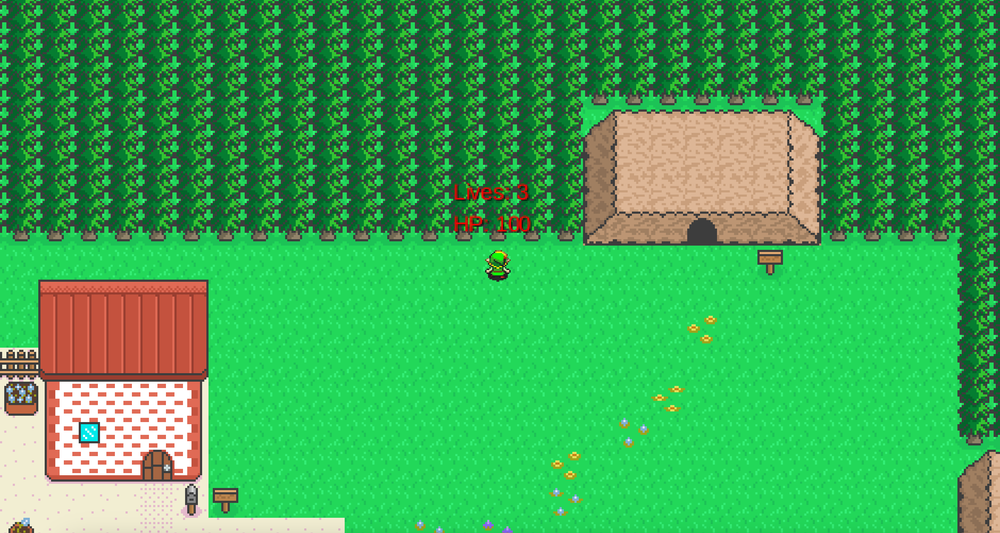
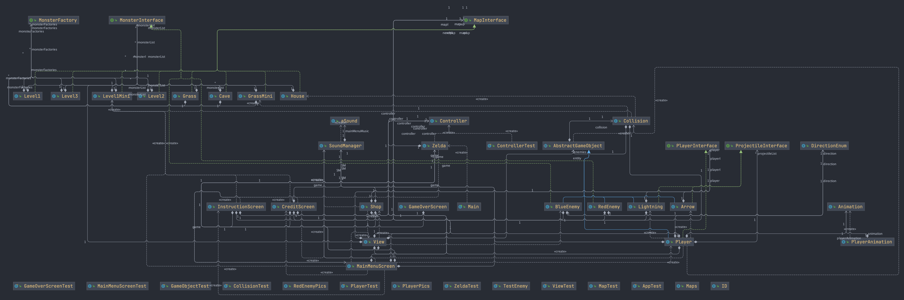

# PROSJEKTRAPPORT

###### Hvordan fungerer rollene i teamet? 
Rollene har fungert veldig bra. Gruppen er aktiv så det har ikke vært like rolle-avhengig som det kunne ha vært. Mange er flinke og tar på seg mange oppgaver og sørger for at ting blir gjort selv. Rollene har hatt en viss innflytelse, men vi har ikke vært avhengig av rollene for å få noe gjort. De fordelte rollene har fungert svært bra.

###### Magnus: TEAMLEAD og GitMaster 

Ansvarlig for individene i gruppen. At alle er involvert og opplever at de utvikles i faget. Drive gruppen videre, hjelper til å beslutte hvis det er utfordrende. Sørge for at frister blir imøtekommet og eventuelt ta tak i ting som ikke fungerer som ønsket.
	
###### Casper: Kommunikasjonsansvarlig 

Ansvar for at vi holder oss til møtepunktene. At vi snakker til hverandre på en god måte og bygger relasjoner med alle på teamet. Han har også ansvar for kontakt ut mot kunden.

###### Bjørn: Dokumentasjonsansvarlig og Arkitekt

Sørge for at både prosjektet er tilstrekkelig dokumentert og at koden er tilstrekkelig dokumentert med javadoc.
Ansvaret for arkitekturen på koden, Slik at den er fin og brukervennlig.
	
###### Hans-Chr: Testansvarlig, trelloMaster	

Sørger for at alle i gruppen skriver robuste tester til koden de implementerer.

###### Elias: Produktutvikler, Mapdesigner

Ansvar for å drive produktet framover slik at vi møter produksjonskrav.

#### Trenger vi andre roller?

Ny rolle: Teambuildingsansvarlig, blir gitt til Magnus. Vi velger å fordele dette ansvaret til Magnus slik at vi i gruppen ikke bare samles for å jobbe med oppgaven, men også for å ha det kjekt sammen. Dette er gunstig for moralen.

Forrige oblig så skrev vi at vi gjorde Bjørn til ansvarlig ovenfor arkitekturen. Dette var en kjempesuksee, og vi er fornøyd med dette.

#### Har vi erfaringer team-messig eller mtp prosjektmetodikk som er verdt å nevne? 	

Nå som vi fikk bedre struktur var det vesentlig mye lettere å fordele oppgaver. Ting ble mye mer seksjonert.

#### Prosjektverktøy: 

-Trello bruker vi aktivt nå og det funker ganske bra for oss. Det blir lagt inn ting som kan gjøres og så plukker vi hver vår ting som ligger der og jobber med dette.

-Vi benytter oss også mye av parprogrammering i gruppetimer og når vi treffes utenom gruppetimen hver onsdag. Spesielt på de litt 'tyngre' oppgavene som å lage maps i TILED. Vi bruker grupperom med tv til å vise frem kode og så parkoder vi alle sammen på gruppen. Ofte bare 2 og 2 også.

-Gitlab blir brukt som Prosjekt holder.

-Discord er det verktøyet vi bruker mest for å kommunisere. Her kommuniserer alt fra ideer til hva vi ønsker å lage. Discord har funket veldig bra, vi bruker det helst for å skrive, men vi har også muligheten for muntlig kommunikasjon. Dette har vært et hjelpemiddel som har gjort det veldig lett for oss å skrive til hverandre. Kommunikasjonen i gruppen hadde vært veldig dårlig om det ikke var for discord.

#### Liker vi valgene vi har tatt underveis?

Ja, vi er svært fornøyd med arkitektrollen til Bjørn. Vi hadde skrevet kode som var veldig "rotete" og mange av filene var avhengig av hverandre så det var svært vanskelig å endre på en fil uten å måtte endre på 2-3 andre. Bjørn gjorde en megajobb med å restrukturere prosjektet og det ble veldig bra. 

#### Hvordan er gruppedynamikken? Uenigheter?

Gruppen har veldig fin dynamikk. Vi har alle lyst til å møte opp og jobbe med prosjektet. Dette er noe som skaper motivasjon for alle som er med i gruppen. Om vi vi gjøre ting anderledes så er alle åpne for hverandres meninger og det har ikke vært noen konflikter. Alle er åpne for god kritikk og klare for å endre det de selv har gjort. 

#### Hvordan har kommunikasjon fungert for oss?

Det har fungert bra. Vi har brukt mye discord-serveren vår utenom de ukentlige møtene våre.

#### Kort retrospektiv om hva som er bra og hva som kan forbedres. Hva har vi fått til til nå? 

###### Hva som er bra:
- Vi har lagt inn tilstrekkelig innsats slik at prosjektet har utviklet seg kontinuerlig over tid. Alle har møtt på gruppemøter 2 til 3 ganger i uken som definitivt har bidratt til denne prosjektutviklingen. 
- I møter og i vår egen discordserver har vi gitt masse positiv feedback når medlemmer deler det de har jobbet med og lagt inn i prosjektet. Vi har også flittig hjulpet hverandre når vi har hatt utfordringer. Rett og slett heier hverandre fram.
- Prosjektet har 'gått seg litt til' underveis, som har gitt rom for individuell kreativitet. Det har skapt eierskap hos gruppemedlemmene. Det kunne vært utfordrende hvis noen har en veldig spesifikk visjon om hvordan ting skal se ut til slutt.
- Engasjement og samarbeid i gruppen er fortsatt bra.

###### Hva kan forbedres: 
- Hvordan vi bruker Trello. Det er veldig lett å hive seg rundt til det man er engasjert for å jobbe med og har snakket med gruppemedlemmer om. Vanen med å gå inn i Trello og velge arbeidsoppgaver utifra der har vært vanskelig å jobbe inn. 
- Tydeligere på hva vi forventer av hverandre i forbindelse med ansvar. (Hva betyr det egentlig at Bjørn er 'dokumentasjonsansvarlig'. Tenker alle det samme om den rollen? Eller testansvarlig Hans C for den slags skyld.) Da kunne vi avdekket eventuelle usikkerheter og støttet hverandre slik at vi får utført rollene bedre. Alt som er utydelig er vanskeligere å ta tak i. 
- Vi ønsket å treffe i et mer sosialt øyemed, men for travle studenter har det enda ikke passet. Det må vi få til. 

###### Fra forrige oblig skulle vi jobbe med disse forbedringspunktene:

1. Se på semesteroppgaveteksten tidligere etter hver innlevering og jobbe med den mer strukturert.**Dette har blitt bedre. Vi var tidlig i gang med å jobbe mot neste frist.**

2. Oppgaver kan være enda mer spesifikt fordelt slik at det er klarere for den enkelte hva han skal gjøre. For eksempel: "Implementer Player klassen" blir for vagt, vi må bli enige om hvilke metoder og funksjonalitet Player skal ha. **Dette har vi også lyktes med. Oppgaver vi snakker om og utfører nå er mye mer detaljert.**

3. Jobbe mer samkjørt, committe og merge oftere. Flere kan jobbe sammen på samme branch i stedet for at alle arbeider på hver sin branch. Dette gjør også at de som arbeider med den samme delen av klassen også må samarbeide tettere. **Dette har også blitt bedre. Teamet vet hva andre holder på med i større grad og jobber med samme brancher. Commits, merging etc blir kommunisert og skjer oftere.** 

#### Bli enige om maks 3 forbedringspunkter som skal følges opp.
1. Jobbe med trello-vanen vår. Sjekke der først! Gå igjennom Trello i starten av hvert gruppemøtet og snakker om hva som må gjøres.
2. Vi er redde for å jobbe på samme branch, så vi ender opp med å lage for mange brancher. Vi kan nok merge enda oftere slik at vi unngår at vi ender opp en branch av en branch av en branch etc.
3. Vi skal sørge for å treffes sosialt. Teambuilding.

## Brukerhistorier, akseptansekriterier og arbeidsoppgaver - Fullførte Oppgaver:

De følgende brukerhistoriene er vi ferdige med. Vi har jobbet mye med refaktorering de siste ukene som har gjort at vi også har gått tilbake og jobbet med og forbedret mange av brukerhistoriene som vi også jobbet med til oblig2.

**1. Som spiller ønsker jeg en MainMenuScreen og en GameOverScreen, slik at jeg kan starte spillet, velge nytt spill og når jeg vinner/taper i spillet så kommer jeg meg tilbake til main menu.**

* Akseptansekriterier:
	1. Vi har en startmeny hvor spilleren kan starte et nytt spill.
	2. Vi har en Active Game skjerm, som er skjermen der spillet kjører.
	3. Når spilleren dør, kommer han til Game Over skjermen og kan starte spillet på nytt.
	
* Arbeidsoppgaver:
	1. Alle 3 skjermene skal vises forskjellig på skjermen, hvor Active Game inneholder selvet spillet.
	2. Lage en Startmeny
	3. Ha en keyListener som registrerer når spilleren trykker på start
	4. Lage en metode som registrerer når spilleren er død/har null hit points.

**2. Som spiller ønsker jeg å se spillbrettet på skjermen slik at jeg kan se hvor jeg kan bevege karakteren min.** 
* Akseptansekriterier:
	1. Spillet starter og viser spillbrettet
		
* Arbeidsoppgaver:
	1. Vi må lage et brett i Tiled
	2. Brettet må vises på skjermen
	
		
**3. Som spiller ønsker jeg å se karakteren min på skjermen slik at jeg kan se hvor jeg er**
* Akseptansekriterier:
	1. Spilleren skal vises på spillbrettet
	
* Arbeidsoppgaver:
	1. Vi må ha en spiller-klasse
	2. Karakteren må ha en posisjon
	3. Karakteren må tegnes på skjermen

**4. Som spiller ønsker jeg at jeg kan bevege karakteren min ved å trykke på tastene slik at jeg kan unngå at fiender skader meg.**
* Akseptansekriterier:
	1. Spilleren skal kunne bevege seg på skjermen i åtte retninger ved å bruke tastene "w", "a", "s", "d"
	
* Arbeidsoppgaver:
	1. Vi må ha en actionListener som registrerer tastetrykk
	2. Vi må sette opp controller slik at spilleren beveger seg nord, vest, sør og øst ved å trykke på henholdsvis "w", "a", "s", "d".
	3. Kombinasjoner av tastetrykkene må bevege spilleren diagonalt
	4. Modellen må oppdateres med den nye posisjonen
	5. Vi må tegne karakteren i den nye posisjonen

**5. Som spiller ønsker jeg at det er lett å skille områdene spilleren kan bevege seg på fra hindringer og vegger slik at det er lett å se hvor jeg kan bevege meg på brettet**
* Akseptansekriterier:
	1. Brettet skal vises med vegger og hindringer
	2. Karakteren skal ikke kunne passere vegger og hindringer
	
* Arbeidsoppgaver:
	1. Spillbrettet må vise ulike tiles
	2. Vi må skille mellom tiles karakteren kan bevege seg over og tiles som karakteren ikke kan passere
	3. Karakteren, vegger og hindringer må ha kollisjonsbokser
	4. Vi må sørge for at karakteren har lov til å flytte seg i riktig retning.
	5. Modellen må ha informasjon om de ulike tiles-ene og hvor de er.
	6. View må vite hva som skal tegnes hvor og hvordan tiles ser ut

**6. Som spiller ønsker jeg å kunne angripe fiendene slik at jeg kan overvinne dem.**

* Akseptansekriterier:
	1. Splilleren på kunne drepe fienden
	2. Fienden skal forsvinne fra brettet når den dør

* Arbeidsoppgaver:
	1. Spillkarakteren må ha en metode som gjør at han skyter eller slår en fiende med et våpen eller på en annen måte skade fienden
	2. Det må være en knapp spilleren kan trykke på for å angripe
	3. Det må registreres når spilleren treffer fienden med våpenet
	4. En fiende må ha hitpoints
	5. Fienden må miste hit points når den blir truffet
	6. Fienden må dø og forsvinne når den ikke har flere hit points

**7. Som spiller ønsker jeg at spillkarakteren har hit points slik at jeg ikke dør med en gang jeg tar skade**

* Akseptansekriterier:
	1. Spilleren skal ha hitpoints og antall hitpoints skal vises på skjermen
	2. Hitpoints skal oppdateres når spilleren tar skade
	3. Spilleren skal dø når hitpoints er mindre eller lik null
	
* Arbeidsoppgaver:
	1. Vi må legge til hitpoints i spillerklassen
	2. Current hitpoints skal vises på skjermen
	3. Hvis hitpoints er mindre enn null, skal det settes til null og spilleren dør
	4. Skrive en metode som oppdaterer hitpoints

**8. Som spiller ønsker jeg at fiendene har hit points slik at noen fiender tåler mer enn andre og spillet blir mer utfordrende**

* Akseptansekriterier:
	1. Fiender skal ha hitpoints
	2. Hitpoints skal oppdateres når fienden tar skade
	3. Fiender skal dø når hitpoints er mindre eller lik null
	
* Arbeidsoppgaver:
	1. Vi må legge til hitpoints i fiende interfacet 
	2. Hvis hitpoints er mindre enn null, skal hitpoints settes til null og fienden dør
	3. Skrive en metode som oppdaterer hitpoints for fiender

**9. Som spiller ønsker jeg at spillet har fiender, slik at det er noe som skjer i spillet som er underholdende**
* Akseptansekriterier:
	1. Spillet må ha en fiende som vises på skjermen
	

* Arbeidsoppgaver:
	1. Vi må ha et interface for fiender
	2. Vi må ha en abstrakt klasse som utvider interfacet og implementerer alle metodene som er felles for alle fiendene
	3. Vi må ha en(eller flere) fiende klasse(r) 
	4. En fiende må ha en startposisjon
	5. En fiende må ha en hitbox
	6. Fienden må ha en oppførsel/bevegelsesmønster
	7. Fienden må tegnes på skjermen

# Krav og spesifikasjon

Vi har prioritert å lage et MVP. Kriteriene for å oppnå dette spesifiserte vi i oblig1.md. Dette var:

1. Vise spillbrettet
2. Vise spilleren på spillbrettet
3. Kunne bruke tastene til å flytte spilleren
4. En enkel fiende spilleren kan bekjempe
5. Spilleren må ha hit points
6. Spilleren må kunne ta skade og dø
7. Spilleren må kunne gå til et nytt rom
8. En teller som viser hvilket nivå/rom nummer(level) spilleren er på
9. Startskjerm når spillet kjøres
10. Game Over skjerm
11. Mulighet til å starte på nytt

Vi har oppfylt det aller meste av dette. Vi har brukt Tiled til å lage spillbrettet og spillkarakteren vises og kan beveges i åtte retninger. Spillet har en startmeny, active game og game over meny. Når spillet er over, kan du starte på nytt. Hvis fienden treffer spilleren, dør han og spillet er over. Vi har laget en attack-animasjon in fire rettninger som du bruker ved å trykke på "x". For å skade og drepe fienden må du holde inne "x" og treffe fienden med sverdet. I spillet kan du gå inn og ut av huset og dermed gå fra et map til neste. Her starter spilleren på level1, går inn i huset og kommer ut igjen til level2 (level1 og level2 er veldig like utseende messig). Vi har en score på skjermen som skal oppdateres hver gang du dreper en fiende. Spilleren og fiendene har foreløpig ikke hit points, spilleren dør hvis han blir truffet og fienden dør når den blir truffet av sverdet. Spilleren kan også gå raskere ved å trykke på "shift"

12.04.2022:

Vi har nå laget det endelige formatet så nå er spillet snart helt ferdig, det mangler litt finpuss her og der. Vi har viderebygget på forrige det vi hadde før. Endret formatet i fra at du skal gå fra level 1-2-3-4....-osv, til at du er i lvl 1 som har huset hvor du da kan gå til nivå 2 som skal være "kampområde" hvor er der hvor det kommer fiender. Når du har slått ut alle monstrene så kan du gå tilbake til nivå 1 og da kan du gå inn i en nivå 2 igjen. Vi har også laget en upgrade meny som gjør at spilleren kan oppgradere angrepene sine. Ingen begrensninger på når du kan oppgradere angrep foreløpig, men dette skal vi lage til neste gang.

### Bugs
* Inne i huset går fiendene ut av av brettet. Dette er fordi fiendene sjekker kollison i hovedbrettet og ikke inne i huset ennå. * Fiender kan også spawne inne i trærne slik at de ikke kan bevege seg.
* Vi har lagt til SpotBugs Maven Plugin i pom.xml for å hjelpe oss til å finne bugs

### Prioriteringer framover

Vi øsnker å implementere poengsystem som skal være koblet med nivåene og også med muligheten for å oppgradere med disse poengene. Implementere en bedre skadefunksjon som gjør at både spilleren og fienden tar skade i henhold med hvilken oppgraderinger spilleren har. Spilleren dreper monster ved vanlig kollisjon nå og dette burde vi endre til å være motsatt. 

Fremover så skal vi priotere mye testing ettersom det er det som er største hindringen nå. Automatisk testing av spilleren og kollisjon. 

Vi skal også designe startskjermen og slike skjermer slik at de blir fin å se på for spilleren.

Gjøre unødige public metoder skal vi gjøre om til private og finpusse overalt.

Spillet har tatt seg en del og det er masse småting som vi mangler for å få det til et fullverdig dataspill som er på det nivået vi ønsker. Med å prioritere testing først samt at vi samtkjører fiksing og utvikling av småting skal dette gå ganske lett for seg om vi fortsetter slik vi gjør nå. Så hoved prioriteringen fremover er å få kontroll på testing slik at vi får en god del tester som er av god kvalitet. Etter dette så er det å finpusse masse kode og implementere noen ting for å skape det fullverdige spillet.

### Brukerhistorier, akseptansekriterier og arbeidsoppgaver til neste innlevering (foreløpig liste)

Dette er brukerhistorier vi vil jobbe med fram mot siste innlevering.

**1. Som fiende ønsker jeg å bli sterkere i løpet av spillet slik at det blir vanskligere for spilleren å drepe meg**

* Akseptansekriterier:
	1. Fiender skal skalere og få mer hitpoints og gjøre mer skade utover i spillet
	
* Arbeidsoppgaver:
	1. Vi implementere en måte å skalere hitpoints til fiendene
	2. Vi implementere en måte å skalere skaden fiendene gjør

**2. Som utvikler ønsker jeg at spilleren skal ta skade når spilleren kolliderer med fiender slik at spillet blir mer utfordrende for spilleren**

* Akseptansekriterier:
	1. Spilleren skal ta skade når spilleren kolliderer med en fiende
	2. Spilleren skal ta ulik skade basert på level og hvilken fiende han kolliderer med
	3. Når spilleren tar skade, skal spilleren ikke kunne ta skade igjen en liten stund for å unngå at spilleren tar kontinuerlig skade når han kolliderer med en fiende
	
* Arbeidsoppgaver:
	1. Implementere kollisjons-sjekk
	2. Implementere metode som gjør spilleren uskadelig en kort periode etter han tar skade
	3. Lage feltvariabler som sier hvor mye skade en fiende gjør på spilleren når de kolliderer

**3. Som spiller ønsker jeg at fiendene skal ha bevegelsesmønster/oppførsel slik at de ikke bare står stille, da blir spillet mer utfordrende og mer underholdende å spille**

* Akseptansekriterier:
	1. Fidende skal ha en oppførsel og bevege seg på skjermen
	
* Arbeidsoppgaver:
	1. Implementere oppførsel/bevegelsesmønster for hver enkel fiende
	2. Sjekke at fiendene beveger seg naturlig og ikke setter seg fast

**4. Som spiller ønsker jeg å få poeng som jeg kan bruke til å oppgradere karakteren min slik at jeg kan utvikle spillkarakteren min**

* Akseptansekriterier:
	1. Spilleren skal få poeng/penger nå han dreper fiender
	2. Poengene kan brukes i butikken for å oppgradere prosjektiler og maxHitpoints
	3. Oppgraderingene skal ha en kostnad
	
* Arbeidsoppgaver:
	1. Lage en metode som gir spilleren poeng
	2. Implementere kostnad på oppgraderingene
	3. Lage metode som sjekker om spilleren har nok poeng til å kjøpe en upgrade

### Hvordan styre karateren i spillet
* Du styrer karateren med "w", "a", "s", "d"
* Skyter pil med space-tasten
* skyter lyn med Enter-tasten
* Åpner og lukker oppgraderings-meny med "k"
* Løper raskere ved å holde inne "L"

## Produkt og kode:
### Dette har vi fikset siden sist:
###### Programmet har fått en helt ny arkitektur.
* Dette gjorde at vi fikk et lite set-back i prosessen og måtte implementere mange av de vitale delene på nytt som f.eks collision, men nå som alt er i orden og programmet fungerer bedre enn før er det mye lettere å implementere nye implementasjoner.
###### Vi har utbedret start menyen.
* Finere Layout og mer responsivt. Lagt til instruksjons-screen, credit-screen og mulighet for å quitte.
###### Vi har lagt til en meny for å oppgraderinger.
* Nå kan man oppgradere antall piler og strømkuler som skytes.
* Man skal også kunne opppgradere health points og movementspeed, men det er ikke implementer.
###### Nå må man drepe alle fiendene i arenaen for å komme seg ut av arenaen.
* Mappet oppdateres når alle fiender er bekjempet.
###### Vi har lagt til lyder for å skyte pil og strømkule.
###### Vi har lagt til musikk i start-menyen.
* Stopper når spillet starter for å fremme fokus til brukeren.
###### Implementert collision mellom fiender og våpen.
* Nå kan man drepe fiender med pil og strømkule uansett hvor mange man skyter.
###### Nye map.
* Vi har lagt til Arenaen som blir låst når man går inn og åpner seg når alle fiender er bekjempet.

### Hva har dere gjort bra, hva hadde dere gjort annerledes hvis dere begynte på nytt?

Vi har vært gode til å bli enige om hva det er vi ønsker å lage. Vi brukte mye tid i begynnelsen til å teste oss fram og lære hva vi skulle gjøre og hvordan vi skulle gjøre det før vi i det hele tatt begynte med prosjektet. 

Når vi har fordelt oppgaver så har folk tatt ansvar på de oppgavene og gjort det som må gjøres. Det er såklart vært noen ganger hvor ting ikke har blitt gjort til akkuratt tid det ble satt, men blir alltid gjort CA til den tiden. Så generelt i gruppen har alle vært flinke til å ta initiativ og ta eierskap til oppgavene de tar og får.  

Vi har vært flinke med å begrense kreativiteten vår for å fokusere på oppgaven: Altså vi stoppet oss selv fra å bare kode kode kode og heller refakturerte/gjorde ting klart til obligen. Det sier mye om hvor ivrige hele gruppen er på å skape et skikkelig produkt.

### Hva vi hadde gjort annerledes hvis vi begynte på nytt?

* Endret fremgangen de første dagene. Kanskje droppet å sitte foran pcen, men heller kjørt noe bli kjent aktiviteter. Derretter sette av at én person lager første "skjelettet". Opplevde at det ble lite framgang når vi ventet på skjelettet.

* Vi skulle ha bestemt oss for arkitekturen med en gang istedenfor å måtte endre på alt midt i det hele. Det tok tid å, for det første, få programmet til å virke som det gjorde før "renovasjonen", og for det andre, til å få hele gruppen til å forstå seg på den nye strukturen. 

* Blitt enige om kommentarer til git tidligere, ikke blande språk.

## Manuell test:

Kollisjon: 

Starter spillet og beveger spilleren mot veggen på kart 1. Holder inne W for å bevege spilleren oppover inn i trærne. Når spilleren treffer trærne skal spilleren ikke lenger bevege seg i den retningen. Dette blir gjort i alle retninger og Spilleren stopper der det er ønskelig.

## Bildet på klassediagrammet

